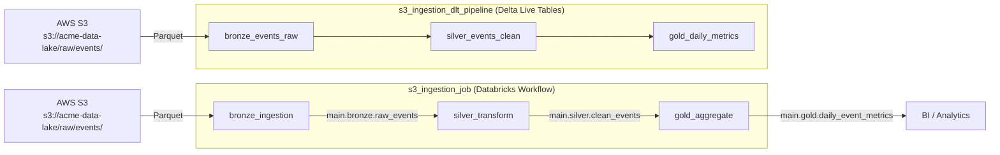

# s3_ingestion_pipeline

## Description & Purpose

This bundle manages a daily ingestion pipeline that pulls raw event data from AWS S3, transforms it through a medallion architecture (bronze → silver → gold), and publishes aggregated daily metrics to Unity Catalog tables for downstream BI consumption.

**Key details:**

- **Business problem:** Centralizes raw event data from S3 into a curated, analytics-ready format using a layered data quality approach.
- **Pipeline overview:** Raw Parquet files are ingested from S3 into a bronze layer, cleaned and deduplicated in a silver layer, then aggregated into gold-layer daily metrics.
- **Owner:** Data Engineering team (`data-engineering@acme.com`)
- **Technologies:** Databricks Workflows, Delta Live Tables (DLT), Unity Catalog, Delta Lake, PySpark, AWS S3, boto3

## Folder Structure

```
s3_ingestion_pipeline/
├── databricks.yml
├── README.md
├── src/
│   ├── bronze_ingestion.py
│   ├── silver_transform.py
│   ├── gold_aggregate.py
│   └── dlt_events_pipeline.py
└── resources/
    └── alerts.yml
```

| Path | Description |
|------|-------------|
| `databricks.yml` | Bundle configuration defining the workflow job, DLT pipeline, job clusters, and deployment targets (dev/prod) |
| `src/bronze_ingestion.py` | Reads raw Parquet event data from S3 and writes to the bronze Unity Catalog table with ingestion metadata |
| `src/silver_transform.py` | Cleans, deduplicates, and standardizes bronze data into the silver layer |
| `src/gold_aggregate.py` | Aggregates silver-layer events into daily metrics in the gold layer |
| `src/dlt_events_pipeline.py` | Delta Live Tables pipeline implementing the same bronze → silver → gold medallion architecture with DLT quality expectations |
| `resources/alerts.yml` | Defines a quality monitor for the gold table and permissions for the ingestion job |

## Job & Pipeline Diagram



## How to Deploy

### Prerequisites

- [Databricks CLI](https://docs.databricks.com/en/dev-tools/cli/index.html) installed and configured
- Access to the target Databricks workspace
- AWS credentials configured for S3 access to `s3://acme-data-lake/raw/events/`
- `boto3` library (installed automatically as a task dependency)

### Deployment Targets

| Target | Workspace Host | Mode | Description |
|--------|---------------|------|-------------|
| `dev` (default) | `https://dbc-example1234.cloud.databricks.com` | development | Development environment; deploys to user-scoped path `/Users/${workspace.current_user.userName}/.bundle/s3_ingestion_pipeline/dev` |
| `prod` | `https://dbc-example5678.cloud.databricks.com` | production | Production environment; deploys to `/Shared/.bundle/s3_ingestion_pipeline/prod` and runs as service principal `sp-data-engineering` |

### Steps

1. Validate the bundle configuration:
   ```bash
   databricks bundle validate
   ```

2. Deploy to the development target (default):
   ```bash
   databricks bundle deploy --target dev
   ```

3. Deploy to production:
   ```bash
   databricks bundle deploy --target prod
   ```

4. Run the ingestion workflow:
   ```bash
   databricks bundle run --target dev s3_ingestion_job
   ```

5. Run the DLT pipeline:
   ```bash
   databricks bundle run --target dev s3_ingestion_dlt_pipeline
   ```

### Target-Specific Notes

- **dev:** Runs as the current user. The DLT pipeline runs in development mode.
- **prod:** Runs as the `sp-data-engineering` service principal. Ensure the service principal has appropriate permissions for the workspace and Unity Catalog.

## Schedule

| Job/Pipeline Name | Schedule (Cron) | Timezone | Pause Status | Description |
|-------------------|----------------|----------|--------------|-------------|
| `s3_ingestion_job` | `0 0 8 * * ?` | `UTC` | UNPAUSED | Runs daily at 8:00 AM UTC |
| `s3_ingestion_dlt_pipeline` | N/A | N/A | N/A | Manual trigger only (no schedule configured) |
| `event_freshness_monitor` | `0 0 10 * * ?` | `UTC` | N/A | Quality monitor runs daily at 10:00 AM UTC |

## Data Sources

| Source Name | Type | Location/Path | Format | Description |
|-------------|------|---------------|--------|-------------|
| Raw events | AWS S3 | `s3://acme-data-lake/raw/events/` | Parquet | Raw event data from production systems; read by `bronze_ingestion.py` and `dlt_events_pipeline.py` |
| `main.bronze.raw_events` | Unity Catalog | `main.bronze.raw_events` | Delta | Bronze-layer raw events table; read by `silver_transform.py` |
| `main.silver.clean_events` | Unity Catalog | `main.silver.clean_events` | Delta | Silver-layer cleaned events table; read by `gold_aggregate.py` |

AWS S3 access requires appropriate IAM credentials configured on the cluster or via instance profiles.

## Data Outputs

| Output Name | Type | Location/Path | Format | Description |
|-------------|------|---------------|--------|-------------|
| `raw_events` | Unity Catalog | `main.bronze.raw_events` | Delta | Raw event data with `_ingested_at` and `_source_file` metadata columns |
| `clean_events` | Unity Catalog | `main.silver.clean_events` | Delta | Cleaned, deduplicated, and standardized event data with `_processed_at` metadata |
| `daily_event_metrics` | Unity Catalog | `main.gold.daily_event_metrics` | Delta | Daily aggregated metrics by `event_date` and `event_type` including `event_count`, `unique_users`, `first_event_at`, `last_event_at` |

The DLT pipeline also produces equivalent tables in the `main.dlt_events` target:
- `bronze_events_raw`
- `silver_events_clean`
- `gold_daily_metrics`

A quality monitor runs daily at 10:00 AM UTC on `main.gold.daily_event_metrics` and sends failure notifications to `data-engineering@acme.com`.

## Managed Assets

| Asset Type | Asset Name | Description |
|------------|-----------|-------------|
| Workflow Job | `s3_ingestion_job` | Orchestrates the bronze → silver → gold ingestion pipeline |
| DLT Pipeline | `s3_ingestion_dlt_pipeline` | Delta Live Tables pipeline for streaming event data processing (target: `main.dlt_events`) |
| Job Cluster | `ingestion_cluster` | Ephemeral cluster (`i3.xlarge`, 2 workers, Spark 14.3.x, SPOT_WITH_FALLBACK) |
| Quality Monitor | `event_freshness_monitor` | Monitors `main.gold.daily_event_metrics` freshness on a daily schedule |

### Permissions

| Asset | Group | Permission Level |
|-------|-------|-----------------|
| `s3_ingestion_job` | `data-engineering` | CAN_MANAGE |
| `s3_ingestion_job` | `data-analysts` | CAN_VIEW |

## Authors

> _Author information not found in bundle configuration. Please fill in manually._

| Name | Role | Contact |
|------|------|---------|
| | Owner / Maintainer | `data-engineering@acme.com` |

## References

- [Databricks Asset Bundles Documentation](https://docs.databricks.com/en/dev-tools/bundles/index.html)
- [Databricks CLI](https://docs.databricks.com/en/dev-tools/cli/index.html)
- [Delta Live Tables](https://docs.databricks.com/en/delta-live-tables/index.html)
- [Unity Catalog](https://docs.databricks.com/en/data-governance/unity-catalog/index.html)
- [Medallion Architecture](https://docs.databricks.com/en/lakehouse/medallion.html)
- [Databricks Workflows](https://docs.databricks.com/en/workflows/index.html)
