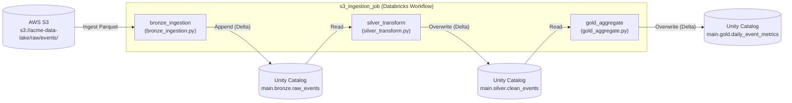
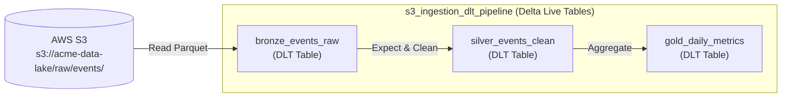

# s3_ingestion_pipeline

## Description & Purpose

This bundle manages a daily ingestion pipeline that pulls raw event data from AWS S3, transforms it through a medallion architecture (bronze → silver → gold), and publishes aggregated metrics to Unity Catalog for downstream BI consumption. It is owned by the **data-engineering** team and operates within the **events** domain.

The pipeline consists of two complementary components:

1. **Databricks Workflow Job (`s3_ingestion_job`)** — A three-task sequential job that ingests raw Parquet files from S3 into the bronze Unity Catalog layer, cleans and deduplicates records in the silver layer, and produces daily aggregated metrics in the gold layer.
2. **Delta Live Tables Pipeline (`s3_ingestion_dlt_pipeline`)** — A DLT pipeline that mirrors the medallion architecture using declarative table definitions with built-in data quality expectations.

Key technologies: **Delta Lake**, **Unity Catalog**, **Delta Live Tables (DLT)**, **Databricks Workflows**, **AWS S3**.

## Folder Structure

```
s3_ingestion_pipeline/
├── databricks.yml
├── README.md
├── src/
│   ├── bronze_ingestion.py
│   ├── silver_transform.py
│   ├── gold_aggregate.py
│   └── dlt_events_pipeline.py
└── resources/
    └── alerts.yml
```

| Path | Description |
|------|-------------|
| `databricks.yml` | Root bundle configuration: deployment targets, job/pipeline definitions, and included resource files |
| `README.md` | This documentation file |
| `src/bronze_ingestion.py` | Reads raw Parquet event data from AWS S3 and writes to the bronze Unity Catalog layer with ingestion metadata |
| `src/silver_transform.py` | Cleans, deduplicates, and standardises bronze events, then writes to the silver Unity Catalog layer |
| `src/gold_aggregate.py` | Aggregates silver events into daily metrics and writes to the gold Unity Catalog layer for BI consumption |
| `src/dlt_events_pipeline.py` | Delta Live Tables pipeline: defines `bronze_events_raw`, `silver_events_clean`, and `gold_daily_metrics` DLT tables |
| `resources/alerts.yml` | Defines the Unity Catalog quality monitor for `main.gold.daily_event_metrics` and job permissions |

## Job & Pipeline Diagram





## How to Deploy

### Prerequisites

- [Databricks CLI](https://docs.databricks.com/en/dev-tools/cli/index.html) v0.200+ installed
- Access to the target Databricks workspace(s) and valid authentication configured (`databricks auth login` or environment variables `DATABRICKS_HOST` / `DATABRICKS_TOKEN`)
- Appropriate permissions to create jobs, pipelines, and Unity Catalog schemas in the target workspace
- For production deployments: the service principal `sp-data-engineering` must exist in the prod workspace

### Deployment Steps

**1. Validate the bundle**
```bash
databricks bundle validate
```

**2. Deploy to the development environment (default)**
```bash
databricks bundle deploy --target dev
```

**3. Deploy to production**
```bash
databricks bundle deploy --target prod
```

**4. Run the workflow job**
```bash
# Run in dev
databricks bundle run --target dev s3_ingestion_job

# Run in prod
databricks bundle run --target prod s3_ingestion_job
```

**5. Run the DLT pipeline**
```bash
# Run in dev
databricks bundle run --target dev s3_ingestion_dlt_pipeline

# Run in prod
databricks bundle run --target prod s3_ingestion_dlt_pipeline
```

### Deployment Targets

| Target | Workspace Host | Mode | Run As | Description |
|--------|---------------|------|--------|-------------|
| `dev` | `https://dbc-example1234.cloud.databricks.com` | `development` | Current user | Default development environment; resources deployed under the user's home path |
| `prod` | `https://dbc-example5678.cloud.databricks.com` | `production` | `sp-data-engineering` | Production environment; resources deployed to `/Shared/.bundle/` |

## Schedule

| Job/Pipeline Name | Schedule (Cron) | Timezone | Pause Status | Description |
|-------------------|----------------|----------|--------------|-------------|
| `s3_ingestion_job` | `0 0 8 * * ?` | `UTC` | UNPAUSED | Runs daily at 08:00 UTC |
| `s3_ingestion_dlt_pipeline` | — | — | — | Manual trigger only (no schedule configured) |
| `event_freshness_monitor` (quality monitor) | `0 0 10 * * ?` | `UTC` | — | Checks data freshness on `main.gold.daily_event_metrics` daily at 10:00 UTC |

## Data Sources

| Source Name | Type | Location/Path | Format | Description |
|-------------|------|--------------|--------|-------------|
| `raw_events` | AWS S3 | `s3://acme-data-lake/raw/events/` | Parquet | Raw event data ingested from production systems; used by both the workflow job and the DLT pipeline |
| `main.bronze.raw_events` | Unity Catalog (Delta) | `main.bronze.raw_events` | Delta | Bronze-layer table read by the `silver_transform` task |
| `main.silver.clean_events` | Unity Catalog (Delta) | `main.silver.clean_events` | Delta | Silver-layer table read by the `gold_aggregate` task |

## Data Outputs

| Output Name | Type | Location/Path | Format | Description |
|-------------|------|--------------|--------|-------------|
| `raw_events` | Unity Catalog (Delta) | `main.bronze.raw_events` | Delta | Bronze table containing raw events with `_ingested_at` and `_source_file` metadata columns; written in append mode |
| `clean_events` | Unity Catalog (Delta) | `main.silver.clean_events` | Delta | Silver table with null-filtered, deduplicated, and standardised events; written with overwrite |
| `daily_event_metrics` | Unity Catalog (Delta) | `main.gold.daily_event_metrics` | Delta | Gold table with daily aggregated event counts and unique user metrics per event type; written with overwrite |
| `bronze_events_raw` | DLT Table | `main.dlt_events.bronze_events_raw` | Delta Live Tables | DLT bronze table — raw events from S3 with ingestion metadata |
| `silver_events_clean` | DLT Table | `main.dlt_events.silver_events_clean` | Delta Live Tables | DLT silver table — cleaned events with data quality expectations enforced |
| `gold_daily_metrics` | DLT Table | `main.dlt_events.gold_daily_metrics` | Delta Live Tables | DLT gold table — daily aggregated event metrics |

## Managed Assets

| Asset Type | Asset Name | Description |
|------------|-----------|-------------|
| Workflow Job | `s3_ingestion_job` | Orchestrates the three-stage bronze → silver → gold ingestion pipeline; runs daily at 08:00 UTC on an `i3.xlarge` spot cluster |
| Job Cluster | `ingestion_cluster` | Auto-provisioned Spark 14.3.x cluster (2× `i3.xlarge` SPOT_WITH_FALLBACK workers) used by all tasks in `s3_ingestion_job` |
| DLT Pipeline | `s3_ingestion_dlt_pipeline` | Delta Live Tables pipeline implementing the medallion architecture declaratively; targets `main.dlt_events` schema |
| Quality Monitor | `event_freshness_monitor` | Unity Catalog quality monitor on `main.gold.daily_event_metrics`; runs daily at 10:00 UTC and emails `data-engineering@acme.com` on failure |
| Job Permission | `s3_ingestion_job_permissions` | `data-engineering` group → `CAN_MANAGE`; `data-analysts` group → `CAN_VIEW` on `s3_ingestion_job` |

## Authors

| Name | Role | Contact |
|------|------|---------|
| — | Owner / Maintainer | *Please fill in manually* |
| data-engineering team | Operations & On-call | data-engineering@acme.com |

## References

- [Databricks Asset Bundles Documentation](https://docs.databricks.com/en/dev-tools/bundles/index.html)
- [Databricks CLI](https://docs.databricks.com/en/dev-tools/cli/index.html)
- [Delta Live Tables Documentation](https://docs.databricks.com/en/delta-live-tables/index.html)
- [Unity Catalog Documentation](https://docs.databricks.com/en/data-governance/unity-catalog/index.html)
- [Databricks Workflows Documentation](https://docs.databricks.com/en/workflows/index.html)
- [Delta Lake Documentation](https://docs.delta.io/latest/index.html)
