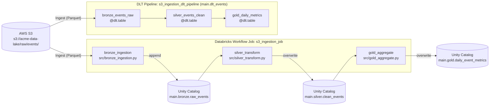

# s3_ingestion_pipeline

## Description & Purpose

This bundle manages a daily ingestion pipeline owned by the **data-engineering** team (events domain). It pulls raw event data from AWS S3, transforms it through a medallion architecture (bronze → silver → gold), and publishes aggregated daily metrics to Unity Catalog for downstream BI consumption. A companion Delta Live Tables (DLT) pipeline provides an alternative streaming-style medallion implementation of the same logic.

Key technologies used:
- **Databricks Workflows** — orchestrates the three-task batch job
- **Delta Live Tables (DLT)** — streaming-capable medallion pipeline with built-in data quality expectations
- **Unity Catalog** — all intermediate and final tables are registered in the `main` catalog
- **Delta Lake** — all outputs are stored in Delta format
- **AWS S3** — source of raw Parquet event data

## Folder Structure

```
s3_ingestion_pipeline/
├── databricks.yml
├── README.md
├── src/
│   ├── bronze_ingestion.py
│   ├── silver_transform.py
│   ├── gold_aggregate.py
│   └── dlt_events_pipeline.py
└── resources/
    └── alerts.yml
```

| Path | Description |
|------|-------------|
| `databricks.yml` | Root bundle configuration: deployment targets, job definition, DLT pipeline definition, and included resource files |
| `README.md` | This documentation file |
| `src/bronze_ingestion.py` | Reads raw Parquet files from S3 and appends them to the bronze Unity Catalog table with ingestion metadata columns |
| `src/silver_transform.py` | Cleans, deduplicates, and standardises bronze event data, then writes to the silver Unity Catalog table |
| `src/gold_aggregate.py` | Aggregates silver event data into daily metrics and writes to the gold Unity Catalog table |
| `src/dlt_events_pipeline.py` | Delta Live Tables notebook defining `bronze_events_raw`, `silver_events_clean`, and `gold_daily_metrics` DLT tables |
| `resources/alerts.yml` | Defines a Unity Catalog quality monitor on the gold table, email failure notifications, and job-level permissions |

## Job & Pipeline Diagram



## How to Deploy

### Prerequisites

- [Databricks CLI](https://docs.databricks.com/en/dev-tools/cli/index.html) v0.200+ installed and configured
- Access to the target Databricks workspace (dev or prod)
- Authentication configured via `databricks configure` or environment variables (`DATABRICKS_HOST`, `DATABRICKS_TOKEN`)
- The service principal `sp-data-engineering` must exist in the prod workspace (used as `run_as` identity)
- AWS credentials / instance profile must be in place on the cluster so it can read `s3://acme-data-lake/raw/events/`

### Validate the bundle

```bash
databricks bundle validate
```

### Deploy

```bash
# Deploy to the dev environment (default)
databricks bundle deploy --target dev

# Deploy to the production environment
databricks bundle deploy --target prod
```

### Run the workflow job

```bash
# Run in dev
databricks bundle run --target dev s3_ingestion_job

# Run in prod
databricks bundle run --target prod s3_ingestion_job
```

### Run the DLT pipeline

```bash
# Run DLT pipeline in dev
databricks bundle run --target dev s3_ingestion_dlt_pipeline

# Run DLT pipeline in prod
databricks bundle run --target prod s3_ingestion_dlt_pipeline
```

### Deployment targets

| Target | Workspace Host | Mode | Notes |
|--------|---------------|------|-------|
| `dev` | `https://dbc-example1234.cloud.databricks.com` | Development (default) | Deploys to each user's personal `.bundle` path |
| `prod` | `https://dbc-example5678.cloud.databricks.com` | Production | Deploys to `/Shared/.bundle/...`; runs as `sp-data-engineering` service principal |

## Schedule

| Job/Pipeline Name | Schedule (Cron) | Timezone | Status | Description |
|-------------------|----------------|----------|--------|-------------|
| `s3_ingestion_job` | `0 0 8 * * ?` | `UTC` | Active (UNPAUSED) | Runs daily at 08:00 AM UTC |
| `s3_ingestion_dlt_pipeline` | — | — | Manual trigger | No schedule configured; triggered on demand or via the workflow job |

## Data Sources

| Source Name | Type | Location/Path | Format | Description |
|-------------|------|--------------|--------|-------------|
| Raw events | AWS S3 | `s3://acme-data-lake/raw/events/` | Parquet | Raw event data produced by upstream production systems; schema merging is enabled |
| `raw_events` (bronze) | Unity Catalog | `main.bronze.raw_events` | Delta | Bronze table consumed by the silver transform task and the DLT pipeline |
| `clean_events` (silver) | Unity Catalog | `main.silver.clean_events` | Delta | Silver table consumed by the gold aggregation task |

## Data Outputs

| Output Name | Type | Location/Path | Format | Description |
|-------------|------|--------------|--------|-------------|
| `raw_events` | Unity Catalog | `main.bronze.raw_events` | Delta | Bronze table: raw events appended with `_ingested_at` and `_source_file` metadata columns |
| `clean_events` | Unity Catalog | `main.silver.clean_events` | Delta | Silver table: cleaned, deduplicated events with standardised types and `_processed_at` column |
| `daily_event_metrics` | Unity Catalog | `main.gold.daily_event_metrics` | Delta | Gold table: daily metrics by `event_date` and `event_type` (event count, unique users, first/last event timestamps) |
| `bronze_events_raw` | DLT Table | `main.dlt_events.bronze_events_raw` | Delta Live Tables | DLT bronze table: raw events from S3 with ingestion metadata |
| `silver_events_clean` | DLT Table | `main.dlt_events.silver_events_clean` | Delta Live Tables | DLT silver table: cleaned events with data quality expectations enforced |
| `gold_daily_metrics` | DLT Table | `main.dlt_events.gold_daily_metrics` | Delta Live Tables | DLT gold table: daily aggregated event metrics |

## Managed Assets

| Asset Type | Asset Name | Description |
|------------|-----------|-------------|
| Workflow Job | `s3_ingestion_job` | Orchestrates the three-stage batch medallion pipeline (bronze → silver → gold) on a daily schedule |
| Job Cluster | `ingestion_cluster` | Spark 14.3.x cluster (`i3.xlarge`, 2 workers, SPOT_WITH_FALLBACK) used by all workflow tasks |
| DLT Pipeline | `s3_ingestion_dlt_pipeline` | Delta Live Tables pipeline implementing the medallion architecture with built-in data quality expectations; targets `main.dlt_events` |
| Quality Monitor | `event_freshness_monitor` | Unity Catalog quality monitor on `main.gold.daily_event_metrics`; checks run daily at 10:00 AM UTC with email failure alerts to `data-engineering@acme.com` |
| Job Permission | `s3_ingestion_job_permissions` | `data-engineering` group → `CAN_MANAGE`; `data-analysts` group → `CAN_VIEW` |

## Authors

| Name | Role | Contact |
|------|------|---------|
| data-engineering team | Owner / Maintainer | data-engineering@acme.com |

> **Note:** Individual author details were not found in the bundle configuration or source code. Please update this table with the names and contacts of the primary maintainers.

## References

- [Databricks Asset Bundles Documentation](https://docs.databricks.com/en/dev-tools/bundles/index.html)
- [Databricks CLI](https://docs.databricks.com/en/dev-tools/cli/index.html)
- [Delta Live Tables Documentation](https://docs.databricks.com/en/delta-live-tables/index.html)
- [Unity Catalog Documentation](https://docs.databricks.com/en/data-governance/unity-catalog/index.html)
- [Delta Lake Documentation](https://docs.delta.io/latest/index.html)
- [Databricks Workflows Documentation](https://docs.databricks.com/en/workflows/index.html)
