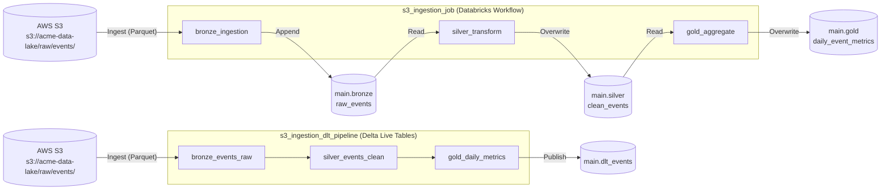

# s3_ingestion_pipeline

## Description & Purpose

This bundle manages a daily ingestion pipeline owned by the **data-engineering** team (domain: events). It pulls raw event data from AWS S3 in Parquet format, transforms it through a medallion architecture (bronze → silver → gold), and publishes aggregated daily metrics to Unity Catalog for downstream BI consumption.

The bundle provides two parallel approaches to the same medallion architecture:

1. **Databricks Workflow Job** (`s3_ingestion_job`) — three sequential PySpark tasks that ingest, clean, and aggregate event data through the `main` Unity Catalog.
2. **Delta Live Tables Pipeline** (`s3_ingestion_dlt_pipeline`) — an equivalent DLT pipeline targeting `main.dlt_events`, with built-in data quality expectations and automated lineage tracking.

Key technologies: Delta Lake, Unity Catalog, Delta Live Tables (DLT), Databricks Workflows, AWS S3.

## Folder Structure

```
s3_ingestion_pipeline/
├── databricks.yml
├── README.md
├── src/
│   ├── bronze_ingestion.py
│   ├── silver_transform.py
│   ├── gold_aggregate.py
│   └── dlt_events_pipeline.py
└── resources/
    └── alerts.yml
```

| Path | Description |
|------|-------------|
| `databricks.yml` | Root bundle configuration: deployment targets, workflow job, and DLT pipeline definitions |
| `README.md` | This documentation file |
| `src/bronze_ingestion.py` | Reads raw Parquet files from S3 and appends them to `main.bronze.raw_events` with lineage metadata |
| `src/silver_transform.py` | Cleans, deduplicates, and standardises bronze data; writes to `main.silver.clean_events` |
| `src/gold_aggregate.py` | Computes daily event metrics from silver data; writes to `main.gold.daily_event_metrics` |
| `src/dlt_events_pipeline.py` | Delta Live Tables equivalent of the medallion pipeline, with `@dlt.expect_or_drop` quality rules |
| `resources/alerts.yml` | Defines a Unity Catalog quality monitor, failure email alerts, and job-level access permissions |

## Job & Pipeline Diagram



## How to Deploy

### Prerequisites

- [Databricks CLI](https://docs.databricks.com/en/dev-tools/cli/index.html) v0.200+ installed and configured
- Authenticated to the target Databricks workspace (`databricks auth login` or `DATABRICKS_HOST` / `DATABRICKS_TOKEN` environment variables set)
- Sufficient permissions to create jobs, DLT pipelines, and Unity Catalog schemas in the target workspace
- For **prod**: the service principal `sp-data-engineering` must exist in the workspace

### Steps

1. **Validate the bundle:**
   ```bash
   databricks bundle validate
   ```

2. **Deploy to a target environment:**
   ```bash
   # Development (default)
   databricks bundle deploy --target dev

   # Production
   databricks bundle deploy --target prod
   ```

3. **Run the workflow job manually:**
   ```bash
   # Development
   databricks bundle run --target dev s3_ingestion_job

   # Production
   databricks bundle run --target prod s3_ingestion_job
   ```

4. **Run the DLT pipeline manually:**
   ```bash
   # Development
   databricks bundle run --target dev s3_ingestion_dlt_pipeline

   # Production
   databricks bundle run --target prod s3_ingestion_dlt_pipeline
   ```

### Deployment Targets

| Target | Workspace Host | Mode | Notes |
|--------|---------------|------|-------|
| `dev` | `https://dbc-example1234.cloud.databricks.com` | `development` | Default target; files deployed to user's home directory |
| `prod` | `https://dbc-example5678.cloud.databricks.com` | `production` | Runs as service principal `sp-data-engineering`; files deployed to `/Shared/.bundle/` |

## Schedule

| Job/Pipeline Name | Schedule (Cron) | Timezone | Pause Status | Description |
|-------------------|----------------|----------|--------------|-------------|
| `s3_ingestion_job` | `0 0 8 * * ?` | `UTC` | UNPAUSED | Runs daily at 08:00 UTC |
| `s3_ingestion_dlt_pipeline` | — | — | — | Manual trigger only (`continuous: false`) |
| `event_freshness_monitor` (quality monitor) | `0 0 10 * * ?` | `UTC` | — | Checks freshness of `main.gold.daily_event_metrics` daily at 10:00 UTC |

## Data Sources

| Source Name | Type | Location/Path | Format | Description |
|-------------|------|--------------|--------|-------------|
| `raw_events` | AWS S3 | `s3://acme-data-lake/raw/events/` | Parquet | Raw event data produced by upstream production systems |
| `main.bronze.raw_events` | Unity Catalog (Delta) | `main.bronze.raw_events` | Delta | Bronze layer table read by the silver transform task |
| `main.silver.clean_events` | Unity Catalog (Delta) | `main.silver.clean_events` | Delta | Silver layer table read by the gold aggregation task |

## Data Outputs

| Output Name | Type | Location/Path | Format | Description |
|-------------|------|--------------|--------|-------------|
| `raw_events` | Unity Catalog (Delta) | `main.bronze.raw_events` | Delta | Raw events appended from S3 with `_ingested_at` and `_source_file` lineage columns |
| `clean_events` | Unity Catalog (Delta) | `main.silver.clean_events` | Delta | Deduplicated, null-filtered, and standardised events; overwritten on each run |
| `daily_event_metrics` | Unity Catalog (Delta) | `main.gold.daily_event_metrics` | Delta | Daily counts, unique users, and event-type breakdowns; overwritten on each run |
| `bronze_events_raw` | DLT Table | `main.dlt_events.bronze_events_raw` | Delta Live Tables | DLT bronze table — raw events with ingestion metadata |
| `silver_events_clean` | DLT Table | `main.dlt_events.silver_events_clean` | Delta Live Tables | DLT silver table — cleaned events with `@dlt.expect_or_drop` quality rules |
| `gold_daily_metrics` | DLT Table | `main.dlt_events.gold_daily_metrics` | Delta Live Tables | DLT gold table — daily aggregated metrics for BI consumption |

## Managed Assets

| Asset Type | Asset Name | Description |
|------------|-----------|-------------|
| Workflow Job | `s3_ingestion_job` | Orchestrates the three-task bronze → silver → gold ingestion pipeline; runs daily at 08:00 UTC |
| DLT Pipeline | `s3_ingestion_dlt_pipeline` | Delta Live Tables pipeline targeting `main.dlt_events`; equivalent medallion architecture with built-in quality expectations |
| Job Cluster | `ingestion_cluster` | Spot-with-fallback cluster (Spark 14.3.x, `i3.xlarge`, 2 workers) used by all workflow job tasks |
| Quality Monitor | `event_freshness_monitor` | Unity Catalog quality monitor on `main.gold.daily_event_metrics`; runs daily at 10:00 UTC and emails `data-engineering@acme.com` on failure |
| Job Permission | `s3_ingestion_job_permissions` | `data-engineering` group → `CAN_MANAGE`; `data-analysts` group → `CAN_VIEW` on `s3_ingestion_job` |

## Authors

| Name | Role | Contact |
|------|------|---------|
| — | Owner / Maintainer | _Please fill in manually_ |

> **Note:** No author metadata was found in the bundle configuration or source files. Update this table with the relevant owner from the `data-engineering` team.

## References

- [Databricks Asset Bundles Documentation](https://docs.databricks.com/en/dev-tools/bundles/index.html)
- [Databricks CLI](https://docs.databricks.com/en/dev-tools/cli/index.html)
- [Delta Live Tables Documentation](https://docs.databricks.com/en/delta-live-tables/index.html)
- [Unity Catalog Documentation](https://docs.databricks.com/en/data-governance/unity-catalog/index.html)
- [Databricks Workflows Documentation](https://docs.databricks.com/en/workflows/index.html)
- [Delta Lake Documentation](https://docs.delta.io/latest/index.html)
