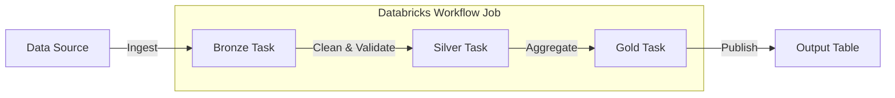

# DAB Name

<!-- INSTRUCTIONS: Replace "DAB Name" with the actual name of the Databricks Asset Bundle. Use the name from databricks.yml. -->

## Description & Purpose

<!-- INSTRUCTIONS:
Provide a clear, concise summary of what this DAB does. Include:
- The business problem it solves
- A high-level overview of the data pipeline or workflow
- The team or domain that owns this bundle
- Any key technologies or Databricks features used (e.g., Delta Live Tables, Unity Catalog, Workflows)

Example:
> This bundle manages a daily ingestion pipeline that pulls raw event data from AWS S3,
> transforms it through a medallion architecture (bronze → silver → gold), and publishes
> aggregated metrics to a Unity Catalog table for downstream BI consumption.
-->

## Folder Structure

<!-- INSTRUCTIONS:
Generate a tree-style representation of the DAB's folder structure. Include all relevant files and directories.
Use the following format:

```
<dab_name>/
├── databricks.yml
├── README.md
├── src/
│   ├── <file1>.py
│   └── <file2>.py
└── resources/
    ├── <resource1>.yml
    └── <resource2>.yml
```

Briefly describe the purpose of each key file and directory in a table:

| Path | Description |
|------|-------------|
| `databricks.yml` | Bundle configuration and deployment targets |
| `src/` | Source code for notebooks and Python scripts |
| `resources/` | YAML definitions for managed Databricks assets |
-->

## Job & Pipeline Diagram

<!-- INSTRUCTIONS:
Create a Mermaid diagram that visually represents the workflow or pipeline defined in this DAB.
Show the relationships between jobs, tasks, pipelines, and data sources/sinks.

Use the following Mermaid diagram as a starting template and modify it based on the actual
resources defined in the /resources/ YAML files and the code in /src/:



Include:
- External data sources and sinks
- Each task in the workflow job(s)
- DLT pipeline stages if applicable
- Dependencies between tasks (use arrows to show data flow)
- Subgraphs for logical groupings (e.g., workflow jobs, pipelines)
-->

## How to Deploy

<!-- INSTRUCTIONS:
Provide step-by-step deployment instructions. Include:

1. Prerequisites (e.g., Databricks CLI installed, workspace access, credentials configured)
2. How to validate the bundle:
   ```bash
   databricks bundle validate
   ```
3. How to deploy to each target environment listed in databricks.yml:
   ```bash
   databricks bundle deploy --target <target_name>
   ```
4. How to run or trigger the deployed workflow:
   ```bash
   databricks bundle run --target <target_name> <job_name>
   ```
5. Any environment variables or secrets that must be configured
6. Note any target-specific configurations (e.g., dev vs prod differences)

List all targets from databricks.yml in a table:

| Target | Workspace Host | Description |
|--------|---------------|-------------|
| `dev` | `https://...` | Development environment |
| `prod` | `https://...` | Production environment |
-->

## Schedule

<!-- INSTRUCTIONS:
Document when and how the jobs/pipelines in this bundle are scheduled to run.
Pull schedule information from the resource YAML files in /resources/.

Present the schedule in a table:

| Job/Pipeline Name | Schedule (Cron) | Timezone | Description |
|-------------------|----------------|----------|-------------|
| `<job_name>` | `0 0 8 * * ?` | `UTC` | Runs daily at 8:00 AM UTC |

If a job has no schedule (manual trigger only), note that as well.
Include any pause/resume status if specified in the config.
-->

## Data Sources

<!-- INSTRUCTIONS:
List all external and internal data sources that this bundle reads from.
Pull this information from the source code in /src/ and the resource configs in /resources/.

Present as a table:

| Source Name | Type | Location/Path | Format | Description |
|-------------|------|--------------|--------|-------------|
| `raw_events` | AWS S3 | `s3://bucket/path/` | Parquet | Raw event data from production systems |
| `ref_data` | Unity Catalog | `catalog.schema.table` | Delta | Reference data for enrichment |

Include any credentials, secrets, or connection details that are referenced (but do NOT include actual secret values).
-->

## Data Outputs

<!-- INSTRUCTIONS:
List all data outputs produced by this bundle.
Pull this information from the source code in /src/ and the resource configs in /resources/.

Present as a table:

| Output Name | Type | Location/Path | Format | Description |
|-------------|------|--------------|--------|-------------|
| `clean_events` | Unity Catalog | `catalog.schema.clean_events` | Delta | Cleaned and validated event data |
| `daily_metrics` | Unity Catalog | `catalog.schema.daily_metrics` | Delta | Aggregated daily metrics |

Note any SLA or freshness requirements if mentioned in the code or configs.
-->

## Managed Assets

<!-- INSTRUCTIONS:
List all Databricks assets that are created and managed by this bundle.
Pull this information from the resource YAML files in /resources/ and databricks.yml.

Present as a table:

| Asset Type | Asset Name | Description |
|------------|-----------|-------------|
| Workflow Job | `<job_name>` | Orchestrates the ingestion pipeline |
| DLT Pipeline | `<pipeline_name>` | Manages the medallion architecture transformations |
| Cluster | `<cluster_name>` | Compute cluster for pipeline execution |
| Dashboard | `<dashboard_name>` | Monitoring dashboard for pipeline metrics |

Include any permissions or access controls defined in the resource configs.
-->

## Authors

<!-- INSTRUCTIONS:
List the authors and maintainers of this bundle. If available, pull from git history
or any metadata in the bundle configuration.

| Name | Role | Contact |
|------|------|---------|
| | Owner / Maintainer | |

If no author information is found, leave this section with a note to fill in manually.
-->

## References

<!-- INSTRUCTIONS:
Include links to relevant documentation and resources:

- [Databricks Asset Bundles Documentation](https://docs.databricks.com/en/dev-tools/bundles/index.html)
- [Databricks CLI](https://docs.databricks.com/en/dev-tools/cli/index.html)
- Links to any internal wiki pages, Jira tickets, or Confluence docs mentioned in the code
- Links to any external APIs or services this bundle interacts with

Add any additional context or notes that would help a new developer understand this bundle.
-->
