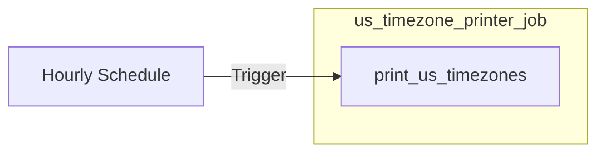

# us_timezone_printer

## Description & Purpose

This bundle runs a simple hourly job that prints the current time for every US timezone (Eastern, Central, Mountain, Pacific, Alaska, and Hawaii). It is intended as a lightweight reference example of a scheduled Databricks Asset Bundle.

## Folder Structure

```
us_timezone_printer/
├── databricks.yml
├── README.md
└── src/
    └── print_us_timezones.py
```

| Path | Description |
|------|-------------|
| `databricks.yml` | Bundle configuration, job definition, and deployment targets |
| `src/print_us_timezones.py` | Notebook that prints the current time in all US timezones |

## Job & Pipeline Diagram



## How to Deploy

1. Install the [Databricks CLI](https://docs.databricks.com/en/dev-tools/cli/index.html) and configure authentication.
2. Validate the bundle:
   ```bash
   databricks bundle validate
   ```
3. Deploy to the target environment:
   ```bash
   databricks bundle deploy --target dev
   ```
4. Run the job on demand:
   ```bash
   databricks bundle run --target dev us_timezone_printer_job
   ```

| Target | Workspace Host | Description |
|--------|---------------|-------------|
| `dev` | `https://dbc-example1234.cloud.databricks.com` | Development environment |
| `prod` | `https://dbc-example5678.cloud.databricks.com` | Production environment |

## Schedule

| Job Name | Schedule (Cron) | Timezone | Description |
|----------|----------------|----------|-------------|
| `us_timezone_printer_job` | `0 0 * * * ?` | `UTC` | Runs every hour at the top of the hour |

## Data Sources

This job has no external data sources. It uses Python's built-in `zoneinfo` module.

## Data Outputs

This job produces no persisted data outputs. It prints to standard output only.

## Managed Assets

| Asset Type | Asset Name | Description |
|------------|-----------|-------------|
| Workflow Job | `us_timezone_printer_job` | Hourly job that prints US timezone times |

## Authors

| Name | Role | Contact |
|------|------|---------|
| — | Owner / Maintainer | — |

## References

- [Databricks Asset Bundles Documentation](https://docs.databricks.com/en/dev-tools/bundles/index.html)
- [Databricks CLI](https://docs.databricks.com/en/dev-tools/cli/index.html)
