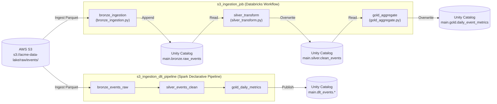

# s3_ingestion_pipeline

## Description & Purpose

This bundle manages a daily ingestion pipeline owned by the **data-engineering** team for the **events** domain. It pulls raw event data from AWS S3 in Parquet format, transforms it through a medallion architecture (bronze → silver → gold), and publishes aggregated daily metrics to Unity Catalog for downstream BI consumption.

The bundle includes two parallel approaches to event processing:
- A **Databricks Workflow job** (`s3_ingestion_job`) that orchestrates three sequential Python tasks across bronze, silver, and gold layers.
- A **Spark Declarative Pipeline** (`s3_ingestion_dlt_pipeline`) that implements the same medallion architecture using declarative DLT tables with built-in data quality expectations.

Key technologies used: **Delta Lake**, **Unity Catalog**, **Spark Declarative Pipelines**, **AWS S3**, and **Databricks Workflows**.

## Folder Structure

```
s3_ingestion_pipeline/
├── databricks.yml
├── README.md
├── src/
│   ├── bronze_ingestion.py
│   ├── silver_transform.py
│   ├── gold_aggregate.py
│   └── dlt_events_pipeline.py
└── resources/
    └── alerts.yml
```

| Path | Description |
|------|-------------|
| `databricks.yml` | Bundle configuration, deployment targets, job and pipeline definitions |
| `README.md` | This documentation file |
| `src/bronze_ingestion.py` | Reads raw Parquet event data from S3 and writes to the Unity Catalog bronze layer with ingestion metadata |
| `src/silver_transform.py` | Reads from the bronze layer, filters nulls, deduplicates by `event_id`, standardizes column types, and writes to the silver layer |
| `src/gold_aggregate.py` | Reads from the silver layer, computes daily event count and unique user metrics by event type, and writes to the gold layer |
| `src/dlt_events_pipeline.py` | Spark Declarative Pipeline defining `bronze_events_raw`, `silver_events_clean`, and `gold_daily_metrics` DLT tables with data quality expectations |
| `resources/alerts.yml` | Quality monitor, failure notification, and job permission definitions |

## Job & Pipeline Diagram



## How to Deploy

### Prerequisites

- [Databricks CLI](https://docs.databricks.com/en/dev-tools/cli/index.html) v0.200+ installed and configured
- Access to the target Databricks workspace (see table below)
- Unity Catalog permissions to create tables in the `main` catalog
- AWS S3 read access to `s3://acme-data-lake/raw/events/` configured on the workspace or cluster IAM role
- For production deployments: the `sp-data-engineering` service principal must be configured in the workspace

### Validate the Bundle

```bash
databricks bundle validate
```

### Deploy

```bash
# Deploy to dev (default)
databricks bundle deploy --target dev

# Deploy to production
databricks bundle deploy --target prod
```

### Run the Workflow Job

```bash
# Run in dev
databricks bundle run --target dev s3_ingestion_job

# Run in production
databricks bundle run --target prod s3_ingestion_job
```

### Run the Spark Declarative Pipeline

```bash
# Run in dev
databricks bundle run --target dev s3_ingestion_dlt_pipeline

# Run in production
databricks bundle run --target prod s3_ingestion_dlt_pipeline
```

### Deployment Targets

| Target | Workspace Host | Mode | Run As | Description |
|--------|---------------|------|--------|-------------|
| `dev` | `https://dbc-example1234.cloud.databricks.com` | `development` | Current user | Default development environment; assets deployed to user-scoped path |
| `prod` | `https://dbc-example5678.cloud.databricks.com` | `production` | `sp-data-engineering` | Production environment; assets deployed to shared path, run as service principal |

## Schedule

| Job/Pipeline Name | Schedule (Cron) | Timezone | Pause Status | Description |
|-------------------|----------------|----------|--------------|-------------|
| `s3_ingestion_job` | `0 0 8 * * ?` | `UTC` | UNPAUSED | Runs daily at 8:00 AM UTC |
| `s3_ingestion_dlt_pipeline` | — | — | — | Manual trigger only (non-continuous pipeline) |
| `event_freshness_monitor` | `0 0 10 * * ?` | `UTC` | — | Quality monitor runs daily at 10:00 AM UTC |

## Data Sources

| Source Name | Type | Location/Path | Format | Description |
|-------------|------|--------------|--------|-------------|
| `raw_events` | AWS S3 | `s3://acme-data-lake/raw/events/` | Parquet | Raw event data ingested by the bronze tasks (both workflow job and DLT pipeline) |
| `raw_events` (bronze) | Unity Catalog | `main.bronze.raw_events` | Delta | Bronze-layer table read by the `silver_transform` task |
| `clean_events` (silver) | Unity Catalog | `main.silver.clean_events` | Delta | Silver-layer table read by the `gold_aggregate` task |
| `bronze_events_raw` (DLT) | Spark Declarative Pipeline | `main.dlt_events.bronze_events_raw` | Delta Live Table | DLT bronze table read by the `silver_events_clean` DLT table |
| `silver_events_clean` (DLT) | Spark Declarative Pipeline | `main.dlt_events.silver_events_clean` | Delta Live Table | DLT silver table read by the `gold_daily_metrics` DLT table |

## Data Outputs

| Output Name | Type | Location/Path | Format | Description |
|-------------|------|--------------|--------|-------------|
| `raw_events` | Unity Catalog | `main.bronze.raw_events` | Delta | Raw event data with `_ingested_at` and `_source_file` metadata columns; written in append mode |
| `clean_events` | Unity Catalog | `main.silver.clean_events` | Delta | Null-filtered, deduplicated, and type-standardized event records; overwritten on each run |
| `daily_event_metrics` | Unity Catalog | `main.gold.daily_event_metrics` | Delta | Daily aggregated metrics (event count, unique users, first/last event time) by `event_date` and `event_type`; overwritten on each run |
| `bronze_events_raw` | Spark Declarative Pipeline | `main.dlt_events.bronze_events_raw` | Delta Live Table | DLT-managed bronze table with raw events and ingestion metadata |
| `silver_events_clean` | Spark Declarative Pipeline | `main.dlt_events.silver_events_clean` | Delta Live Table | DLT-managed silver table; records failing `event_id`, `event_timestamp`, or `user_id` non-null checks are dropped |
| `gold_daily_metrics` | Spark Declarative Pipeline | `main.dlt_events.gold_daily_metrics` | Delta Live Table | DLT-managed gold table with daily aggregated event metrics for BI consumption |

## Managed Assets

| Asset Type | Asset Name | Description |
|------------|-----------|-------------|
| Workflow Job | `s3_ingestion_job` | Orchestrates the three-task bronze/silver/gold ingestion pipeline; runs daily at 8:00 AM UTC on an `i3.xlarge` SPOT cluster |
| Job Cluster | `ingestion_cluster` | Auto-provisioned Spark 14.3 cluster (2× `i3.xlarge` workers, SPOT_WITH_FALLBACK) used by all tasks in `s3_ingestion_job` |
| Spark Declarative Pipeline | `s3_ingestion_dlt_pipeline` | Declarative pipeline implementing the same medallion architecture; targets `main.dlt_events` in Unity Catalog |
| Quality Monitor | `event_freshness_monitor` | Monitors `main.gold.daily_event_metrics` for freshness; runs daily at 10:00 AM UTC; emails `data-engineering@acme.com` on failure |
| Job Permission | `s3_ingestion_job` → `data-engineering` group | `CAN_MANAGE` permission for the data-engineering group |
| Job Permission | `s3_ingestion_job` → `data-analysts` group | `CAN_VIEW` permission for the data-analysts group |

## Authors

| Name | Role | Contact |
|------|------|---------|
| — | Owner / Maintainer | *(please fill in manually)* |

> **Note:** No author metadata was found in the bundle configuration or source files. Please update this table with the appropriate owner and contact information.

## References

- [Databricks Asset Bundles Documentation](https://docs.databricks.com/en/dev-tools/bundles/index.html)
- [Databricks CLI](https://docs.databricks.com/en/dev-tools/cli/index.html)
- [Spark Declarative Pipelines (Delta Live Tables)](https://docs.databricks.com/en/delta-live-tables/index.html)
- [Unity Catalog Overview](https://docs.databricks.com/en/data-governance/unity-catalog/index.html)
- [Delta Lake Documentation](https://docs.delta.io/latest/index.html)
- [Databricks Workflows](https://docs.databricks.com/en/workflows/index.html)
